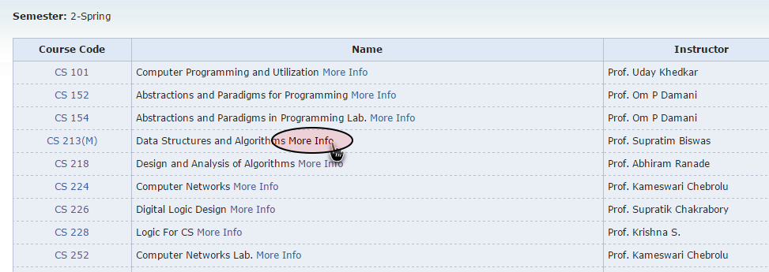
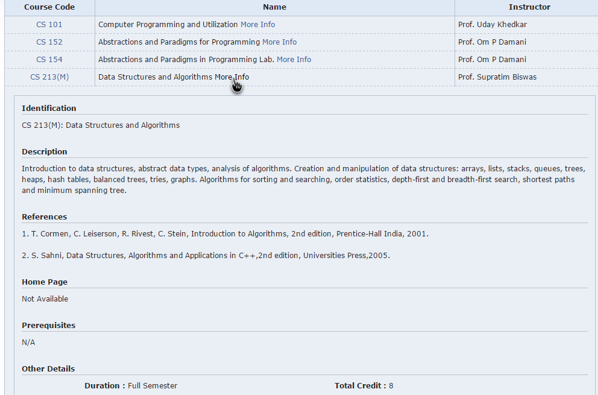

# IIT-B CS Course Inline Load
A Chrome browser extension to load IIT-B CS Course "More Info" links inline.
-- --

Install the extension from here:

Goto any IIT-B CS course page (Eg. [Spring Course List](https://www.cse.iitb.ac.in/page137))

Clicking the More Info links will load the data within the webpage as opposed to the default (without extension) behavior of redirecting you.

-- --

The extension also makes the course page span the entire width of the window.